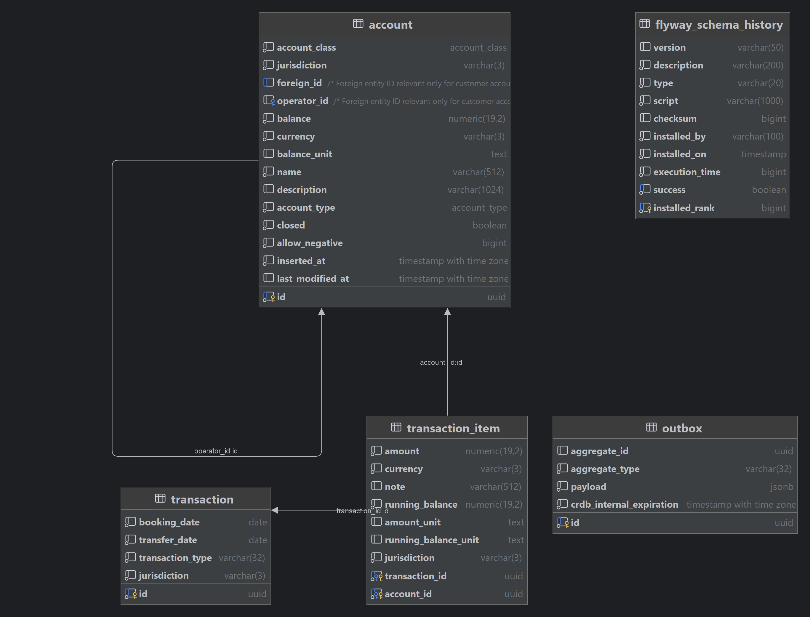

# Design Notes

Burp-a-bet is based on a typical lightweight, self-contained and stateless Spring Boot application architecture.

## Design Patterns

The following architectural patterns are demonstrated:

- Saga pattern for distributed business transactions without 2PC/XA
- Transactional outbox pattern

## Architectural Mechanisms

Architectural mechanisms are used to realize architectural requirements. These can be divided into three
levels of refinement: Analysis mechanisms, design mechanisms and implementation mechanisms. The table below
shows three categories of architectural mechanisms and shows how they are expressed in each of these categories.

| Analysis               | Design                   | Implementation                                                                        | Constraints and Characteristics                                                                                                                                                                                                                                                                                                      |
|------------------------|--------------------------|---------------------------------------------------------------------------------------|--------------------------------------------------------------------------------------------------------------------------------------------------------------------------------------------------------------------------------------------------------------------------------------------------------------------------------------|
| Persistence            | RDBMS                    | CockroachDB                                                                           | Cockroach Cloud dedicated. Multi-region supported by not required. Enterprise license needed to unlock key features like CDC.                                                                                                                                                                                                        | 
| Data Access            | ORM                      | JPA, Hibernate, JDBC, Spring Data                                                     | Services use JPA for ORM persistence with Hibernate as the persistence provider and Spring Data JPA as main abstraction. For simpler data access, plain JDBC is used through the Spring JDBC template.                                                                                                                               | 
| Transaction Management | RDBMS / Event Bus        | Local data source transactions (no XA) and outbox events.                             | Services lean on ACID guarantees within their bounded contexts. Business transactions are eventually consistent and driven by the Saga orchestration and transactional outbox patterns using CockroachDB and Kafka Streams in concert. AOP aspects are used for transaction retries, session attributes and producing outbox events. | 
| Versioning             | RDBMS                    | Online schema upgrades, Flyway                                                        | Flyway is used to maintain database schema versions. CockroachDB provides online schema upgrades with zero downtime.                                                                                                                                                                                                                 | 
| Interoperability       | HTTP/REST                | Spring HATEOAS / Hypermedia APIs                                                      | Spring MVC, Spring Hateoas using HAL+json media type                                                                                                                                                                                                                                                                                 | 
| Observability          | HTTP/Logging             | SLF4J + Logback via Spring, Spring Boot Actuators, TTDDYY datasource proxy logging.   |                                                                                                                                                                                                                                                                                                                                      | 
| Resource Management    | HTTP/Logging             | HikariCP for connection pooling, data retention using CockroachDB TTLs.               | Provides support for the management of expensive resources, such as database connections. TTLs to evict expired outbox events.                                                                                                                                                                                                       | 
| Eventing               | Commit Log and Streaming | Kafka Streams used to link request and response topics.                               |                                                                                                                                                                                                                                                                                                                                      | 
| Web Server             | Embedded Container       | Embedded Jetty servlet container.                                                     |                                                                                                                                                                                                                                                                                                                                      | 
| Load Balancing         | L4 / L7                  | L4 load balancer between app instances and CockroachDB. L7 in front of app instances. | (Optional) Any load balancer, for example HAProxy in self-hosted.                                                                                                                                                                                                                                                                    | 
| Platform and Build     | Java                     | JDK 17                                                                                | JDK 17 language level (OpenJDK compatible)                                                                                                                                                                                                                                                                                           | 
| Frontend               | HTML+CSS, Shell          | Bootstrap 3 + Thymeleaf and/or Spring Shell                                           | For applicable services-                                                                                                                                                                                                                                                                                                             | 

# Wallet Service

The service uses the following entity model for double-entry bookkeeping of monetary transaction history.

- **account**  - Accounts with a derived balance from the sum of all transactions
- **transaction**  - Balanced multi-legged monetary transactions
- **transaction_item** - Association table between transaction and account representing a leg with a running account
  balance.

# Customer Service

The service uses the following entity model for double-entry bookkeeping of monetary transaction history.

- **customer**  - Customer registrations

# Betting Service

The service uses the following entity model for double-entry bookkeeping of monetary transaction history.

- **race**  - A race at a given track, with a given horse and the decimal odds
- **bet**  - A customer bet for a given race

# Appendix: Kafka Topics

These topics are created on-demand when starting the services. During a service bootstrap phase, the CockroachDB 
change feeds are also created (through Flyway) for the outbox table of each service. Most event publications 
go through the transactional outbox pattern.

| Topic                | Purpose                                                |
|----------------------|--------------------------------------------------------|
| registration         | Registration events published by customer-service      |
| placement            | Placement events published by betting-service          |
| settlement           | Settlement events published by betting-service         |
| wallet-registration  | Registration reply events published by wallet-service  |
| wallet-placement     | Placement reply events published by wallet-service     |
| wallet-settlement    | Settlement reply events published by wallet-service    |
| betting-registration | Registration reply events published by betting-service |
| customer-placement   | Placement reply events published by customer-service   |
| customer-settlement  | Settlement reply events published by customer-service  |

